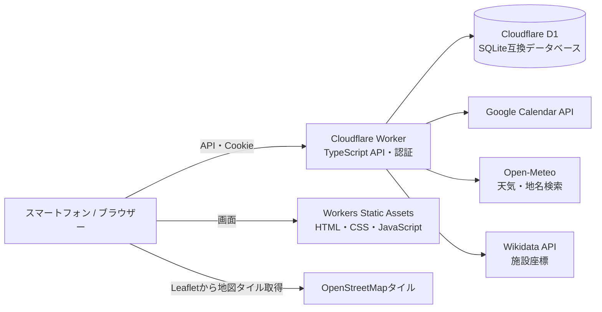
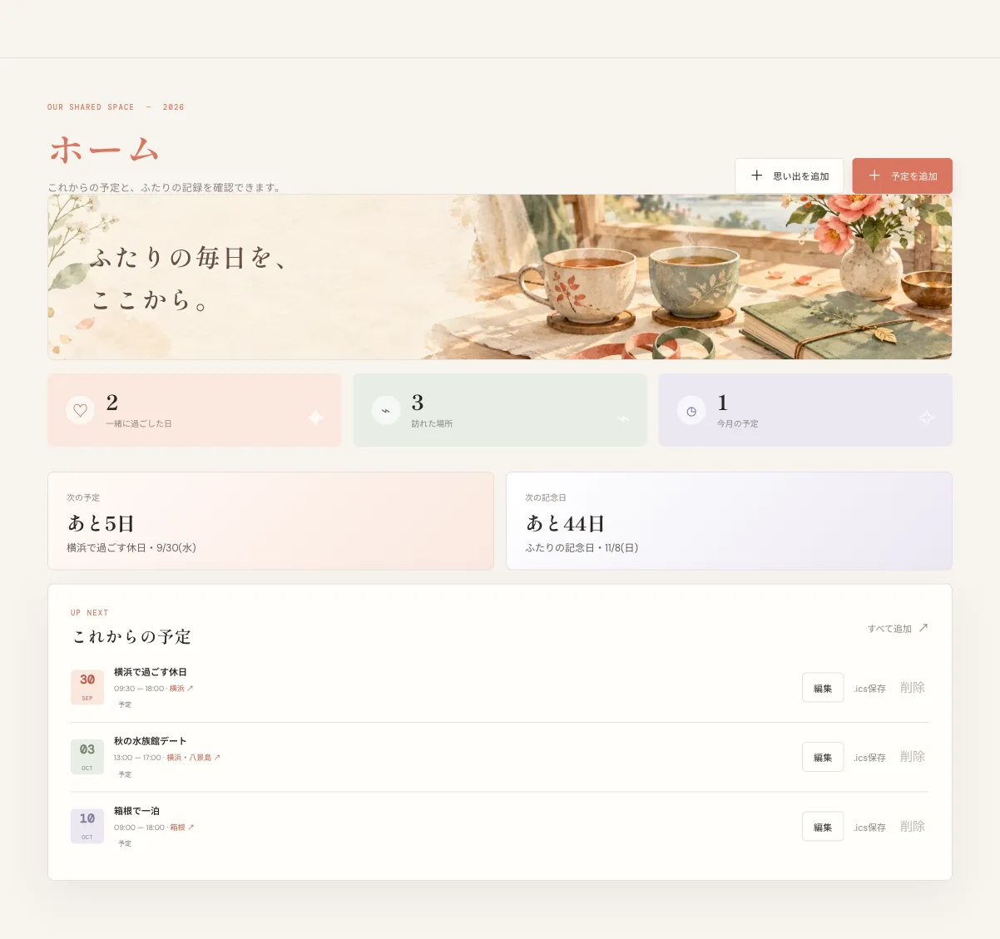
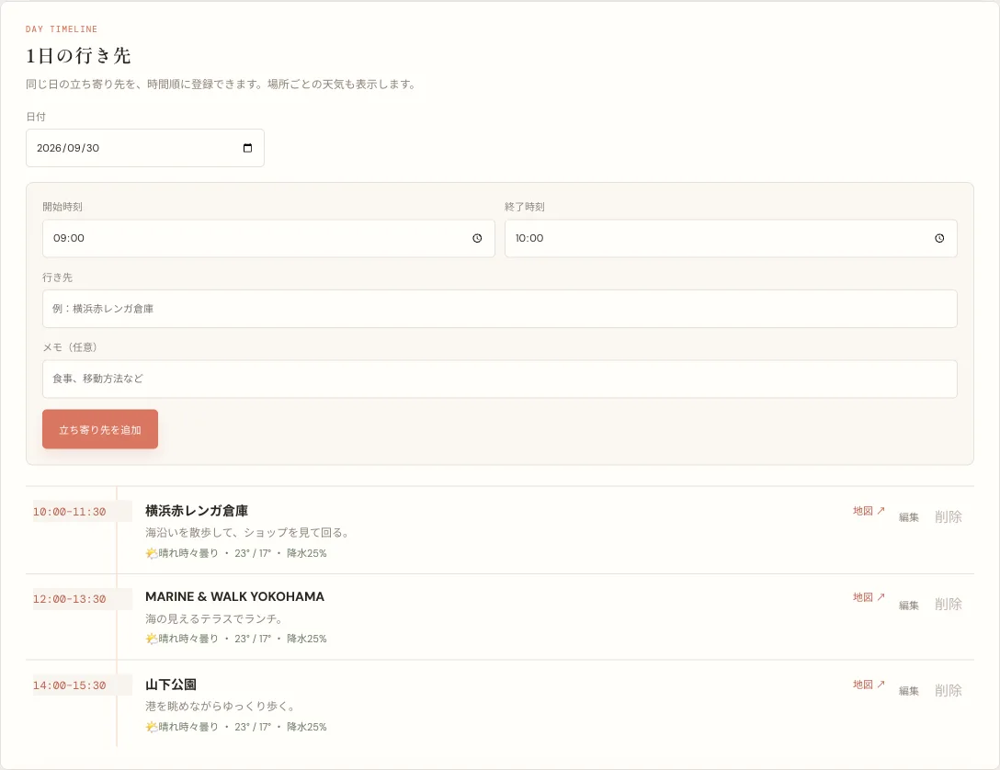
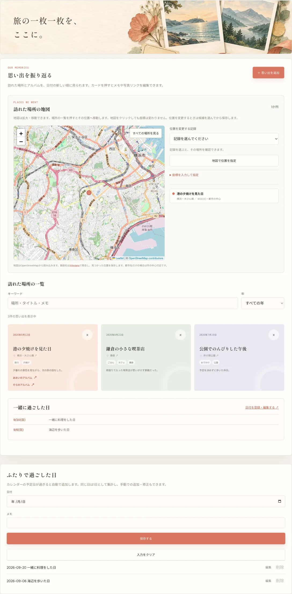
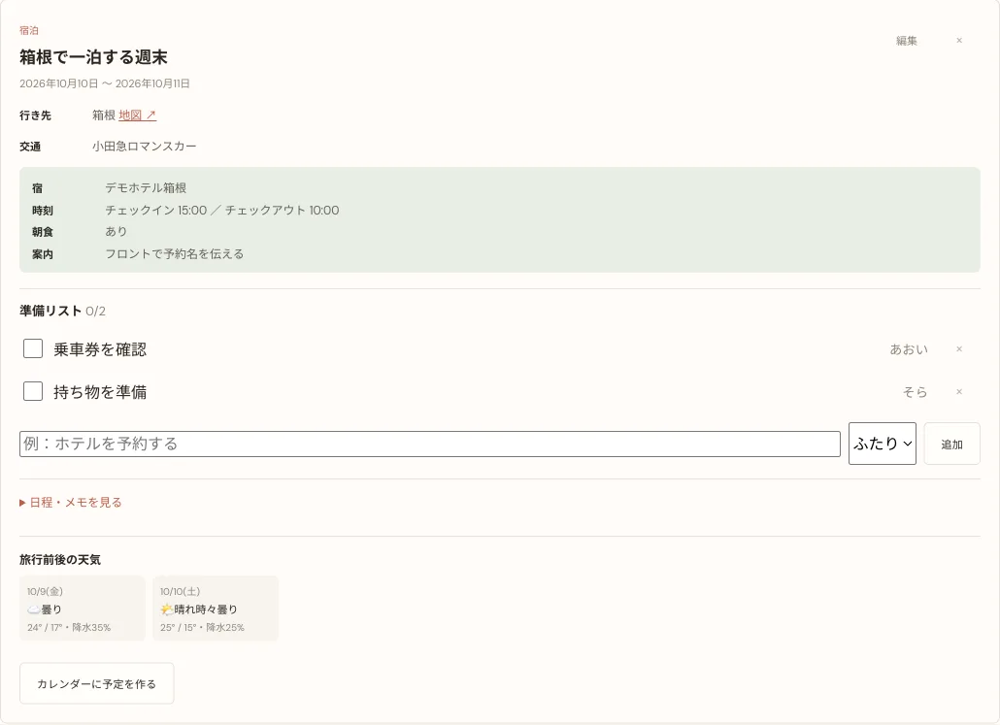

# Codex最小課金プランで個人Webアプリはどこまで作れるか

今回の目的は、個人で契約できるCodexのPulsを使い、個人的なWebアプリをどこまで自動で作れるか、自分でコードを書かずにどこまで実現できるかを試すことです。
業務ではenterprise版を利用していますが、自分用に課金するプランを検討するため、このアプリ作成を行いました。
題材には、遠距離で暮らす2人の予定調整、旅行計画、訪れた場所や写真リンクをまとめるアプリを選びました。

自然言語で要望を伝え、Codexに既存コードの調査、実装、テスト、修正を繰り返し依頼しました。人間側は必要な機能や優先順位を決め、画面を確認して修正点を伝え、Google CloudやCloudflareなど外部サービスのアカウント設定・認証情報登録を行います。この記事では「完全に人手が不要だった」とはせず、コードを書く作業をAIに任せると何ができ、どこに人間の判断や設定が残るのかを、実際の技術構成と一緒に紹介します。

この記事本文はGPT-6-Lunaで作成しています。アプリの実装を補助したCodexとは別の役割です。

> 掲載画面はすべてローカルの隔離デモ環境で撮影しています。表示名、メールアドレス、予定、場所メモ、旅行、アルバムURLは架空のサンプルです。本番画面や実利用者の情報は使っていません。

## Codexに任せた作業と、人間が行ったこと

アプリ作成では、個人向けCodexの最小課金プランを利用しました。既存リポジトリを読み、機能追加やUI変更を実装し、型チェック・統合テストを実行し、失敗した箇所を修正するところまで、Codexに段階的に依頼しました。カレンダー連携、旅行計画、天気、地図、思い出管理など、要望を会話で伝えて動作を確認し、必要な調整を重ねています。

この試みでいう「自分でコードを書かない」は、要件や画面を考えなくてよいという意味ではありません。人間は機能の優先順位を決め、結果を確認して追加の指示を出しました。また、Google CloudのOAuth同意画面やAPI有効化、CloudflareのSecretsやAccess設定、アカウントの認証と本番環境の確認は、所有者本人の操作・判断が必要です。AIは手元のコード作業を大きく代行できますが、外部サービスの本人確認や資格情報を受け取って設定する作業まで自動で完了するわけではありません。

作業環境にはOrcaを使いました。リポジトリのワークスペース、ターミナル、ローカルのWorkers実行、ブラウザーでの操作と画面確認を同じ作業場所で行えます。たとえば今回の画面画像は、本番サイトを撮影せず、ローカル用D1に架空データを入れてからブラウザーで撮っています。

AIは実装や調査を速めますが、仕様判断やセキュリティの保証を代わりに行うものではありません。外部APIの利用条件、認証の境界、実データを含まないこと、テスト結果は人が確認する必要があります。

## アプリ内の画像について

アプリのホーム、次の予定、カレンダー、行きたいところ、思い出、旅行計画、記念日ページに配置した装飾用バナー画像は、生成AIで作成したイラストです。実在する旅行写真や利用者が撮影した写真ではありません。この記事のスクリーンショットは、それらの画像を含むローカルデモ画面を撮ったものです。思い出として表示されるアルバムURLや写真も架空のデモ用リンクで、本物の写真は含めていません。

## 全体構成

このアプリは、フロントエンドとAPIを同じCloudflare Workerで提供し、永続データをD1に保存します。HTML/CSS/JavaScriptなどはWorkers Static Assetsから配信し、`/api/*`へのリクエストはWorkerのTypeScriptハンドラーで処理します。別のNode.jsサーバーや画像ストレージは使っていません。



デプロイ設定は`wrangler.jsonc`にまとめています。Workerのエントリーポイント、Static Assetsのディレクトリ、D1のバインディング、互換性日付、ログ・トレース、Cron Triggerを宣言し、Workerからは`env.DB`のようなバインディングでリソースを使います。D1はマイグレーションを番号順に適用し、スキーマ変更をコードと一緒に追えるようにしています。15分ごとのCron Triggerで通知の送信時刻を確認し、日次処理では期限切れの認証レコード整理や過去イベントの思い出化を行います。Cloudflareの[Static Assets](https://developers.cloudflare.com/workers/static-assets/)と[Observability](https://developers.cloudflare.com/workers/observability/)を利用し、Workerのログとトレースも有効にしています。

日常の読み書きはWorkerバインディング経由です。SQLには値を文字列連結せず、`prepare(...).bind(...)`でパラメーターを渡します。こうすると入力値とSQL構文を分離でき、型の境界も見やすくなります。Cloudflare Workersの[Bindingsの考え方](https://developers.cloudflare.com/workers/runtime-apis/bindings/)と[D1 Worker API](https://developers.cloudflare.com/d1/worker-api/)に沿った構成です。

## Cloudflareの無料枠でどこまで動かせるか

このアプリは、画像をアップロードせず、常時起動するサーバーや有料のストレージを持たない構成です。2人が予定を登録し、必要なときに閲覧する個人利用なら、現行のCloudflare Workers Free枠で動かせる設計にしています。静的ファイルの配信、少量のAPI実行、D1の小さな共有データベース、Cloudflare Accessのメール制限を組み合わせています。Workers Free枠は1日10万件のWorkerリクエストと1実行あたりCPU 10ms、Static Assetsへのリクエストは無料・無制限です。Cloudflare AccessのFree Planは50ユーザー未満向けなので、2人だけの利用には十分な範囲です。

D1のWorkers Free枠は、1日あたり最大500万行の読み取り、10万行の書き込み、アカウント合計5GBの保存容量です。1つのD1データベースはFree枠で最大500MB、1回のWorker実行内でD1へ発行できるクエリ数は50です。D1の読み書き上限を超えると、保存済みのデータが消えるわけではありませんが、上限がリセットされるまで新しいクエリがエラーになります。したがって「無料でずっと無制限」ではなく、利用量をCloudflareダッシュボードで確認する運用が必要です。インデックスと日次キャッシュで不要なスキャンや外部API呼び出しを抑えています。

このWorkerは15分ごとの通知処理と、日次の記録整理にCron Triggerを使います。Worker LogsはWorkers Freeに含まれ、現行条件では1日20万イベント・3日保持です。Wrangler設定ではログを有効にし、トレースは1%をサンプリングしています。2026年9月25日の確認時点ではトレースの無料ベータは同月30日までで、Cloudflareは10月1日からログと同じイベント枠・料金体系に含めると案内しています。記事を公開・更新する時点で料金表を再確認してください。

Cloudflareの上限で特に注意するのは、ログイン処理のscryptパスワード検証です。Workers FreeのCPU上限は1実行10msなので、CPU時間はアカウントの実測メトリクスで確認し、上限エラーが出る場合は実装やプランを見直す必要があります。ローカルテストが通ることだけでは、本番の無料枠内での実行時間までは保証できません。

料金枠はデプロイ設定から読み取れる構成上の見込みであり、個別アカウントの実請求・使用量を示すものではありません。Cloudflareの[Workers料金・Free枠](https://developers.cloudflare.com/workers/platform/pricing/)、[Workers制限](https://developers.cloudflare.com/workers/platform/limits/)、[D1料金](https://developers.cloudflare.com/d1/platform/pricing/)、[D1制限](https://developers.cloudflare.com/d1/platform/limits/)、[AccessのFree Plan](https://www.cloudflare.com/sase/products/access/)は更新されるため、最新条件とCloudflareダッシュボード上の実使用量を確認してください。

Cloudflare以外のサービスは、それぞれ別の利用条件です。天気はOpen-Meteoの無料・非商用条件、地図タイルはOpenStreetMapの利用ポリシーに従います。Google Calendar APIの利用枠やOAuth公開要件もGoogle側で管理され、Cloudflareの無料枠に含まれるわけではありません。写真を共有URLだけにしているため、このアプリは画像用バケットやR2ストレージを使いません。

### ローカル開発も本番データから分ける

画面確認にはローカルのWranglerとローカルD1を使い、実在しないユーザー・予定・思い出を投入しました。本番のD1 IDやSecretsを読み込む設定は使わず、一時的なローカル設定に切り替えています。こうすると、本番データを誤って画面に出したり、デモ用の操作で本番データを変更したりする危険を減らせます。

デモ画面は次のとおりです。



ホーム画面上部のイラストは生成AIで作成したものです。画面写真は、架空データを入れたローカルデモを撮影しています。

## 天気予報：場所名を座標にしてから取得する

天気APIは緯度・経度を受け取るため、イベントに入力された「場所」から座標を解決する必要があります。このアプリでは、行き先や1日の立ち寄り先を元に、サーバー側でまずWikidataの施設名検索を試し、座標が見つからない場合にOpen-Meteo Geocoding APIで地名を検索します。その座標を使ってForecast APIを問い合わせます。予報には日ごとの天気コード、最高・最低気温、最大降水確率を使います。

実装の中心は次の処理です（エラー処理やキャッシュ更新などを省略した概略です）。

```ts
const geocodeUrl = new URL("https://geocoding-api.open-meteo.com/v1/search");
geocodeUrl.search = new URLSearchParams({
  name: location,
  count: "5",
  language: "ja",
  countryCode: "JP",
  format: "json",
}).toString();

const forecastUrl = new URL("https://api.open-meteo.com/v1/forecast");
forecastUrl.search = new URLSearchParams({
  latitude: String(latitude),
  longitude: String(longitude),
  timezone: "Asia/Tokyo",
  forecast_days: "16",
  daily: "weather_code,temperature_2m_max,temperature_2m_min,precipitation_probability_max",
}).toString();
```

予報は現在から最大16日分です。旅行計画では出発前日と帰宅翌日も対象にし、当日の行き先タイムラインでは各立ち寄り先に対応する予報を表示します。旅行先が異なる場合、それぞれの地域の座標で問い合わせます。

呼び出しのたびに同じ地名を外部APIへ送らないよう、D1の`weather_cache`に座標・解決した地名・予報JSON・取得日を保存します。同じ日本時間の日付内ではキャッシュを使い、日付が変わった後の最初のアクセスで新しい予報を取得します。更新に失敗した場合は以前のキャッシュを返し、古い予報であることを`stale`として表示します。外部APIに依存しながら画面の全体をエラーにしないためのフォールバックです。



Open-Meteoは緯度・経度を使うForecast APIと地名検索のGeocoding APIを提供しています。無料APIは個人・非商用利用向けの条件があるため、[利用条件](https://open-meteo.com/en/terms)と[Forecast APIの仕様](https://open-meteo.com/en/docs)を確認し、画面に出典を表示します。無料枠の回数や商用条件は変わる可能性があるため、利用形態が変わる場合は最新条件を読み直す必要があります。

## 地図：Leaflet、OpenStreetMap、Wikidataを役割分担

インタラクティブな地図にはLeafletを使い、ベースマップにはOpenStreetMapの標準タイルを表示します。Leafletは地図のパン・ズーム、マーカー描画を担い、地図画像そのものは`tile.openstreetmap.org`からブラウザーが取得します。地図上の位置をクリックしただけで既存の記録が書き換わらないようにし、記録を選択して配置モードに入ったときだけ仮マーカーを出します。保存操作を明示し、意図しない座標変更を防ぎます。

```js
memoryMap = L.map("japan-map", { scrollWheelZoom: false }).fitBounds(japanBounds);
L.tileLayer("https://tile.openstreetmap.org/{z}/{x}/{y}.png", {
  maxZoom: 19,
  attribution: "&copy; OpenStreetMap contributors",
}).addTo(memoryMap);
```



思い出ページ上部のコラージュ風イラストも生成AIで作成しています。地図部分はOpenStreetMapの地図タイルです。

施設名から緯度・経度を補う場合は、Wikidataの日本語検索APIで候補を検索し、完全一致する候補だけを採用します。続けてエンティティの座標プロパティ（P625）を取得し、日本国内の範囲内であることを確認します。候補が曖昧、座標がない、範囲外などの場合は自動確定せず、手動指定に任せます。地名が同じ別施設にピンが飛ぶ問題を避けるため、あいまいな検索結果を推測で採用しない方針です。

プライバシー対策として、自動検索へ送る文字列は公開施設名を想定し、住所やメモを送らないようにしています。自宅・住所に関する語、数字やURL形式などは検索対象から除外します。取得した座標はD1にキャッシュし、毎回Wikidataへ問い合わせることも避けています。

OpenStreetMapの地図データは利用できますが、公開標準タイルサーバーは無制限の無料配信を保証するCDNではありません。帰属表示を残し、キャッシュや識別要件を含む[タイル利用ポリシー](https://operations.osmfoundation.org/policies/tiles/)を守る必要があります。アクセスが増えるサービスでは、利用規模に合うタイル提供事業者や自前ホスティングを検討します。Leaflet自体は表示ライブラリであり、タイルサーバーとは別の役割です。[Leafletリファレンス](https://leafletjs.com/reference/)も参照してください。

## 旅行計画：共有する情報だけをデータモデルにする

旅行計画は日帰り・宿泊を同じレコードで扱い、旅行種別に応じて終了日や宿泊情報を表示します。移動手段、行き先、宿泊施設の公式サイト、チェックイン・アウト時刻、朝食、キャンセル期限、チェックイン案内、日程メモ、2人で共有する準備項目をD1に保存します。宿泊施設や予約サイトのメールを自動解析する機能はまだありません。金額・予約番号・確認メール全文などは今回の共有対象にせず、必要なURLや当日の案内だけを残す設計です。



思い出の写真は画像ファイルをD1やWorkerへアップロードせず、Googleフォトの共有アルバムURLを保存します。URLは許可したGoogleフォトのホスト名とHTTPSを検証し、2人分の欄を分けて誰が登録したリンクか表示します。画像ストレージを運用せずに済みますが、リンクを知る人が閲覧できる設定かどうかはGoogleフォト側で管理します。

## Googleカレンダー連携：読み込みと書き込み先を分ける

Google Calendar APIはOAuth 2.0で各ユーザーから認可を受けます。アカウントごとに表示名を設定し、複数のカレンダーから表示対象を選択できます。空き時間検索では、選択されたGoogleカレンダーの予定と、このサイト上の共有予定を照合します。

サイトで作成した共有予定を、連携済みユーザーそれぞれの同期先カレンダーへ追加・更新・削除します。同期先は表示対象とは独立して選べます。二重登録を避けるため、D1にサイト予定とGoogle上のイベントIDの対応を保存し、次の同期では既存イベントを更新します。

GoogleのRefresh TokenはD1へ平文で保存せず、Web CryptoのAES-GCMで暗号化します。暗号鍵、OAuth Client SecretなどはWrangler設定ファイルやGitに書かず、Cloudflare Worker Secretsで管理します。Google Cloud側のOAuth同意画面、許可スコープ、公開ステータス、各ユーザーの再認可も運用上の要件です。

## 認証・データ保護の要点

登録済みのメールアドレスとパスワードでログインします。初回設定と再設定はCloudflare Accessによるメール本人確認を通し、通常のAPIではWorker側のパスワードセッションを検証します。パスワードはランダムソルトとscryptでハッシュ化し、平文は保存しません。セッションCookieは`Secure`、`HttpOnly`、`SameSite=Lax`を指定し、D1にはセッショントークンそのものではなくSHA-256ハッシュを保存します。ログイン試行にはIP・メール単位のレート制限を設けています。

共有先が2人と決まっているため、許可メールのリストをWorker Secretで制限し、プロフィール名と実メールアドレスの対応もデプロイ環境で設定します。記事、スクリーンショット、Git履歴には実際のメールアドレス・パスワード・OAuth秘密情報を含めません。

## テストとローカル確認

このプロジェクトでは、TypeScriptの型チェック、ブラウザー側JavaScriptの構文チェック、Worker APIの統合テスト、認証、カレンダー、空き時間、Google読み込みに関するテストを実行できます。ローカル画面も実際に開き、APIが成功してデータが描画されることと、スクリーンショットに実データが含まれないことを確認しました。

機能を増やす過程では、API入力検証やレスポンス生成を`src/core.ts`にまとめ、旅行計画、思い出、行き先などをモジュールに分割しています。データベース変更は`migrations/`に追加し、既存レコードがある状態でも移行できるか統合テストで確認します。AIにコードを書かせた場合も、型チェックやテスト、画面確認を省略しないことが大切です。

## 旅行記録で外部APIを使うときの学び

地図と天気は「便利なAPIを呼ぶ」だけでは完成しません。場所名の曖昧さ、予報の更新頻度、外部API障害、無料利用の条件、タイルの帰属表示、検索時に個人住所を外部へ送らない設計まで決める必要があります。

今回の構成では、天気は日次キャッシュと古いデータへのフォールバック、施設座標は一致条件と国内範囲のチェック、地図上の変更は明示的な保存操作で扱いました。個人向けの小さなアプリでも、失敗時にどう振る舞うかと、何を外部サービスへ送るかを先に考えておくと安心です。

---

### スクリーンショットとデモデータ

掲載画像は、ローカルで起動した隔離環境の画面です。表示名、アカウント、イベント、施設メモ、旅行情報はすべて架空のデモデータで、本番のユーザー情報や写真は使っていません。

## 動画デモ

以下の動画は、同じローカルデモをブラウザーで操作して録画したものです。訪問地点の地図にはOpenStreetMapのタイルと架空の訪問記録が表示され、予定の天気はOpen-Meteoから取得した予報を表示しています。アカウント名、予定、旅行、行き先はすべて架空で、本番サイトには接続していません。

<video controls preload="metadata" playsinline width="100%">
  <source src="/videos/futari-calendar-local-demo.mp4" type="video/mp4" />
  お使いのブラウザーは動画再生に対応していません。
</video>
